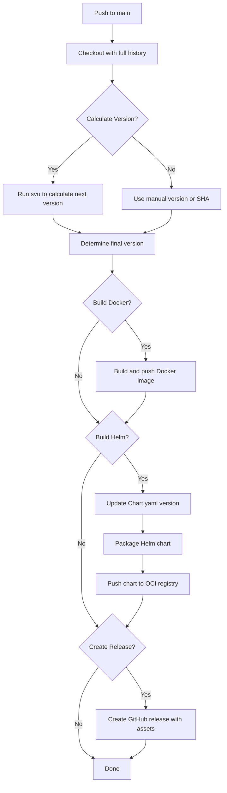

# OCI Helm GitHub Action - Project Overview

This repository contains a reusable GitHub Action for building and deploying OCI container images and Helm charts with automatic semantic versioning.

## What's Inside

### Core Action
- **action.yml** - The main composite action that orchestrates Docker builds, Helm packaging, and releases

### Documentation
- **README.md** - Comprehensive documentation with usage examples and API reference
- **QUICKSTART.md** - Step-by-step guide to get started in minutes
- **CONTRIBUTING.md** - Guidelines for contributors with conventional commit standards
- **CHANGELOG.md** - Version history and release notes
- **LICENSE** - MIT License

### Example Workflows
Located in `.github/workflows/`:
- **example-full.yml** - Complete CI/CD pipeline with linting, testing, and deployment
- **example-docker-only.yml** - Build and push Docker images only
- **example-helm-only.yml** - Package and push Helm charts only
- **example-manual-version.yml** - Manual version control with workflow_dispatch

### Test Application
Located in `examples/test-app/`:
- Minimal Docker application
- Sample Helm chart with deployment template
- Test workflow for validating the action

## Key Features

### 1. Semantic Versioning
- Automatic version calculation using **svu**
- Based on conventional commits (feat, fix, BREAKING CHANGE)
- Git tag creation and pushing

### 2. Docker Support
- Multi-platform builds (amd64, arm64, etc.)
- GitHub Actions cache integration
- Custom build arguments
- Automatic tagging (versioned + latest)

### 3. Helm Support
- OCI registry support
- Automatic Chart.yaml version alignment
- Dependency management
- Package and push to registries

### 4. GitHub Integration
- Automatic release creation
- Custom release notes
- Artifact attachment (Helm packages)
- Full integration with GitHub Container Registry

### 5. Flexibility
- Enable/disable Docker or Helm independently
- Manual version override option
- Custom paths and configurations
- Multiple registry support

## How It Works



## Repository Structure

```
oci-helm-githubaction/
├── action.yml                          # Main action definition
├── README.md                           # Full documentation
├── QUICKSTART.md                       # Getting started guide
├── CONTRIBUTING.md                     # Contribution guidelines
├── CHANGELOG.md                        # Version history
├── LICENSE                             # MIT License
├── .gitignore                          # Git ignore rules
│
├── .github/workflows/                  # Example workflows
│   ├── example-full.yml               # Complete CI/CD pipeline
│   ├── example-docker-only.yml        # Docker only build
│   ├── example-helm-only.yml          # Helm only deployment
│   └── example-manual-version.yml     # Manual versioning
│
└── examples/test-app/                  # Test application
    ├── Dockerfile                      # Sample Docker image
    ├── entrypoint.sh                   # Container entrypoint
    ├── README.md                       # Test app documentation
    ├── helm/                           # Sample Helm chart
    │   ├── Chart.yaml
    │   ├── values.yaml
    │   └── templates/
    │       ├── _helpers.tpl
    │       └── deployment.yaml
    └── .github/workflows/
        └── test.yml                    # Test workflow

```

## Usage Example

```yaml
name: Deploy

on:
  push:
    branches: [ main ]

permissions:
  contents: write
  packages: write

jobs:
  deploy:
    runs-on: ubuntu-latest
    steps:
      - uses: hauke-cloud/oci-helm-githubaction@v1
        with:
          image-name: ghcr.io/${{ github.repository }}
          oci-namespace: ${{ github.repository_owner }}/charts
          registry-password: ${{ secrets.GITHUB_TOKEN }}
```

## Extracted From

This action was extracted from the [bookmark-generator](https://github.com/hauke-cloud/bookmark-generator) project's CI/CD workflow, making it reusable across multiple projects.

## Version Strategy

The action uses **svu** (Semantic Version Util) which automatically determines the next version based on:

- **Patch** (0.0.X): Commits with `fix:` prefix
- **Minor** (0.X.0): Commits with `feat:` prefix  
- **Major** (X.0.0): Commits with `feat!:` or `BREAKING CHANGE:` in footer

## Publishing to GitHub Marketplace

To publish this action:

1. Create a repository on GitHub: `hauke-cloud/oci-helm-githubaction`
2. Push this code to the repository
3. Create a release with a tag (e.g., `v1.0.0`)
4. Go to repository settings and publish to marketplace

## Next Steps

1. **Test the Action**: Copy `examples/test-app` to a new repo and test
2. **Create First Release**: Tag `v1.0.0` to create the initial release
3. **Publish**: Publish to GitHub Marketplace for public use
4. **Iterate**: Add features based on user feedback

## Requirements for Using This Action

1. Git repository with at least one tag
2. Dockerfile (if building Docker images)
3. Helm chart in `./helm/` or custom location (if deploying Helm)
4. GitHub workflow with proper permissions

## Support

- GitHub Issues: Report bugs and request features
- GitHub Discussions: Ask questions and share ideas
- Pull Requests: Contribute improvements

## License

MIT License - Free to use, modify, and distribute.
